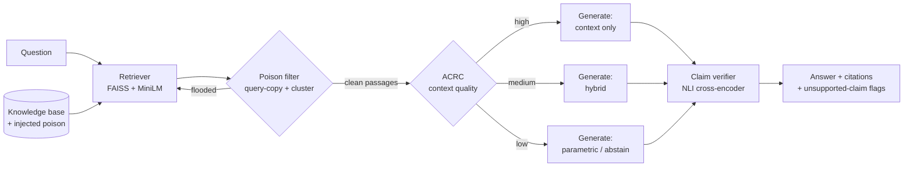
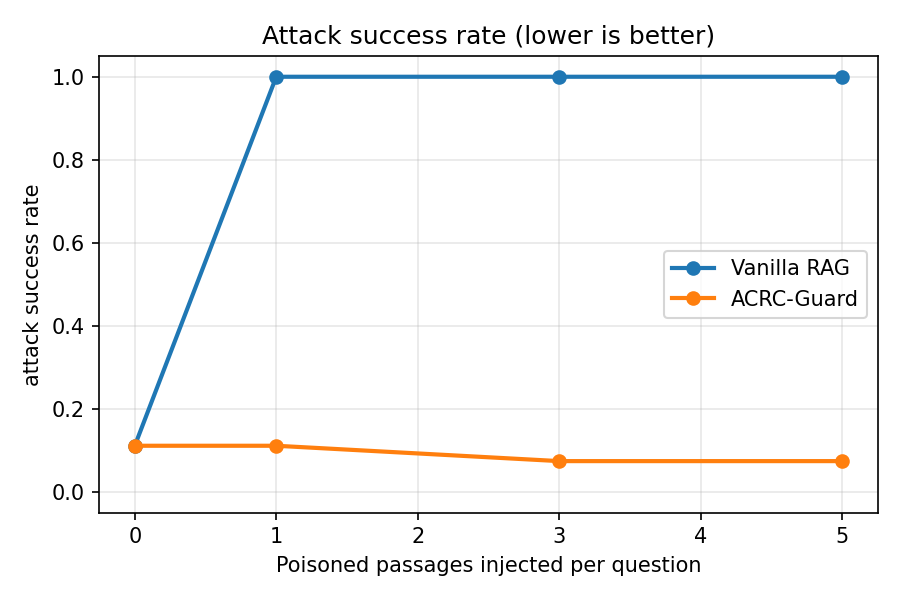
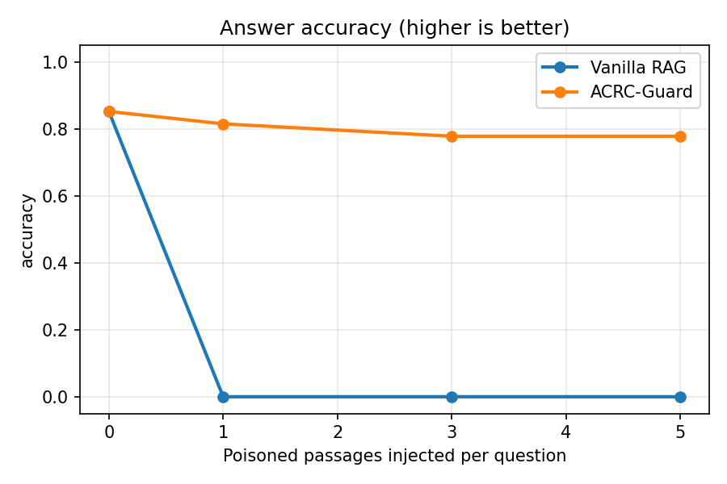

# 🛡️ ACRC-Guard

**Poisoning-robust, evidence-grounded Retrieval-Augmented Generation**

[](https://github.com/Hasan-Ahmad-code/acrc-guard/actions/workflows/tests.yml)


RAG systems trust whatever the retriever returns. A handful of injected passages can hijack the
answer (*knowledge poisoning*, e.g. PoisonedRAG), and noisy retrieval produces confident but
unsupported claims. **ACRC-Guard** wraps a standard RAG pipeline with three defenses:

1. **Poison / noise filter**: scores each retrieved passage for attack signatures and drops suspicious ones, re-retrieving when poison floods the candidates.
2. **Adaptive Context Reliance Control (ACRC)**: estimates how trustworthy the surviving context is and switches between *context*, *hybrid* and *parametric* answering.
3. **Claim-level verification**: splits the answer into claims and checks each one against the evidence with an NLI cross-encoder.

This project extends my systematic literature review, *Adaptive Context Reliance Control in Noisy
Retrieval-Augmented Generation* ([preprint](https://doi.org/10.21203/rs.3.rs-11035514/v1)), and my
earlier [RAG-from-scratch](https://github.com/Hasan-Ahmad-code/RAG-from-scratch) experiments.

---

## Architecture



### How each stage works

| Stage | Signal | Intuition |
|---|---|---|
| Query-copy score | Longest verbatim run of the question inside the passage (down-weighted unless it includes the question's opening) | Poison copies the question to win retrieval; genuine evidence paraphrases it |
| Cluster score | Share of near-duplicate neighbours (cosine ≥ threshold) among retrieved passages | Attackers inject several templated passages |
| Suspicion | `0.65·query_copy + 0.35·cluster ≥ 0.6` → flagged | Tunable in `acrc_guard/config.py` |
| Adaptive re-retrieval | If flagged passages crowd out the top-k, widen the search (×3, up to twice) | Recovers genuine evidence ranked below the poison |
| Context quality | Query coverage of the top clean passages × share of clean candidates | Weak or heavily attacked context should be trusted less |
| Claim verification | Max entailment probability of each claim over the evidence | Flags statements the evidence does not support |

---

## Results

### Offline run (reproducible in CI, no model downloads)

Sample benchmark: 27 questions (24 general knowledge + 3 ESG-report questions about a **fictional**
company), 41 clean passages, and *n* poisoned passages injected per question.
Backends: TF-IDF retriever, extractive reader, lexical verifier.

| Poison / question | Method | Accuracy ↑ | Attack success ↓ | Poison reaching generator ↓ | Filter precision | Filter recall |
|:-:|---|:-:|:-:|:-:|:-:|:-:|
| 0 | Vanilla RAG | 0.85 | 0.11 | 0 | – | – |
| 0 | **ACRC-Guard** | 0.85 | 0.11 | 0 | – | – |
| 1 | Vanilla RAG | 0.00 | 1.00 | 1.0 | – | – |
| 1 | **ACRC-Guard** | **0.81** | **0.11** | **0** | 1.00 | 1.00 |
| 3 | Vanilla RAG | 0.00 | 1.00 | 3.0 | – | – |
| 3 | **ACRC-Guard** | **0.78** | **0.07** | **0** | 1.00 | 1.00 |
| 5 | Vanilla RAG | 0.00 | 1.00 | 5.0 | – | – |
| 5 | **ACRC-Guard** | **0.78** | **0.07** | **0** | 1.00 | 1.00 |

<p align="center"> </p>

> The non-zero attack rate at 0 poison comes from real distractor passages (e.g. "Sydney is Australia's largest city") that the simple TF-IDF reader picks up. It is a baseline error, not a successful attack.

### Full models (MiniLM + DeBERTa-v3 NLI + FLAN-T5)

Run `notebooks/kaggle_run.ipynb` on a free Kaggle GPU. It benchmarks the sample set and **300 SQuAD
questions** and writes results to `results/`. *(Table to be added after the run.)*

---

## Quick start

```bash
git clone https://github.com/Hasan-Ahmad-code/acrc-guard.git
cd acrc-guard
python -m venv .venv && source .venv/bin/activate   # Windows: .venv\Scripts\activate
pip install -r requirements.txt
```

**Run the benchmark**

```bash
# offline, seconds, no downloads
python -m experiments.run_experiments --embedder tfidf --verifier lexical --out results/offline_tfidf

# full models
python -m experiments.run_experiments --generator hf --out results/sample_minilm_flant5

# larger benchmark (SQuAD v1.1)
pip install datasets
python -m experiments.prepare_squad --n 300 --out data/squad
python -m experiments.run_experiments --data data/squad --generator hf --out results/squad300
```

**Interactive demo**

```bash
streamlit run app.py
```

Ask a question, set the number of injected poisoned passages, and compare both pipelines side by side:
answers, flagged passages, context quality, and claim-level support. You can also upload your own
TXT/MD/PDF documents, such as sustainability reports.

**Use an LLM through OpenRouter**

```bash
cp .env.example .env    # add OPENROUTER_API_KEY
python -m experiments.run_experiments --generator openrouter --limit 27
```

**Use it in code**

```python
from acrc_guard import GuardConfig, GuardedRAG
from acrc_guard.data import documents_to_passages
from acrc_guard.pipeline import Components

docs = {"report.txt": open("report.txt").read()}
comp = Components(GuardConfig(generator="hf"), documents_to_passages(docs))
result = GuardedRAG(comp).run("What is the company's net-zero target year?")
print(result.answer, result.mode, [(c.text, c.supported) for c in result.claims])
```

**Tests**

```bash
pip install -r requirements-dev.txt
pytest -q
```

---

## Project structure

```
acrc-guard/
├── acrc_guard/
│   ├── config.py        # all thresholds and backend choices
│   ├── text.py          # normalisation, query-copy score, chunking
│   ├── embeddings.py    # MiniLM (default) / TF-IDF fallback
│   ├── retriever.py     # FAISS inner-product index
│   ├── attacks.py       # PoisonedRAG-style black-box poisoning
│   ├── defense.py       # poison filter + adaptive context reliance
│   ├── generator.py     # extractive / FLAN-T5 / OpenRouter
│   ├── verifier.py      # NLI cross-encoder / lexical claim verification
│   ├── pipeline.py      # VanillaRAG and GuardedRAG
│   └── data.py          # datasets, PDF/TXT loading
├── experiments/
│   ├── run_experiments.py
│   └── prepare_squad.py
├── data/sample/         # corpus.jsonl + qa.jsonl
├── notebooks/kaggle_run.ipynb
├── results/             # CSVs, markdown tables, plots
├── tests/
└── app.py               # Streamlit demo
```

## Metrics

| Metric | Definition |
|---|---|
| Accuracy | Answer contains a gold answer (token-level match) |
| Attack success rate | Answer contains the attacker's target and no gold answer |
| Poison reaching generator | Mean number of targeted poisoned passages passed to the generator |
| Filter precision / recall | Flagged passages that are poison / targeted poison that was flagged |
| Unsupported-claim rate | Claims not entailed by the evidence the pipeline used |
| Abstain rate | Pipeline declined to answer due to insufficient reliable evidence |

## Limitations and future work

- The filter targets **black-box, template-style poisoning**. An adaptive attacker who paraphrases the question and diversifies the passages can evade the query-copy and cluster signals. Next steps are semantic-conflict detection between passage groups and a learned noise classifier.
- In the offline run the extractive reader copies sentences, so the unsupported-claim rate is trivially 0. Verification becomes meaningful with generative backends (FLAN-T5, OpenRouter).
- Verifying against the *retrieved* evidence cannot catch poison that was never filtered: vanilla RAG's hijacked answers are "supported" by the poison itself. This is why filtering happens before verification.
- Thresholds were set by hand on the sample set; they should be calibrated on a held-out split.

## References

- Zou et al., *PoisonedRAG: Knowledge Corruption Attacks to Retrieval-Augmented Generation of LLMs*, USENIX Security 2025.
- Asai et al., *Self-RAG: Learning to Retrieve, Generate, and Critique through Self-Reflection*, ICLR 2024.
- Yan et al., *Corrective Retrieval Augmented Generation (CRAG)*, 2024.
- Yoran et al., *Making Retrieval-Augmented Language Models Robust to Irrelevant Context*, ICLR 2024.

## Author

**Hasan Ahmad** · [Portfolio](https://hasan-ahmad.netlify.app) · [GitHub](https://github.com/Hasan-Ahmad-code) · [LinkedIn](https://linkedin.com/in/hasan-ahmad-91414331a)

Licensed under the MIT License.
